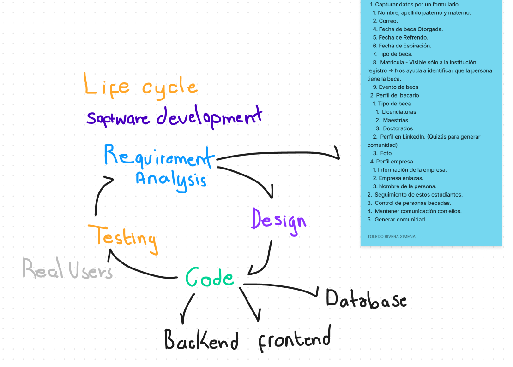
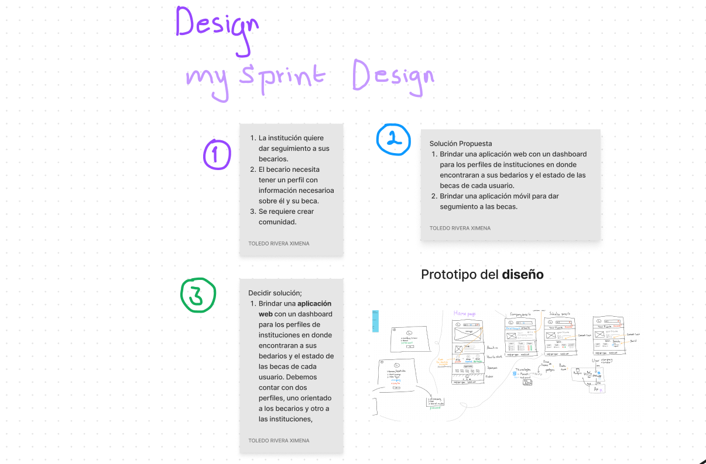

## Life-Cycle
1. Realizamos anotaciones de requerimientos
2. Realizamos diseño de base de datos y de transferencia de datos.
3. Codificamos y diseñamos la parte del front.
   1. Propuesta de diseño.

## Sprint Design

